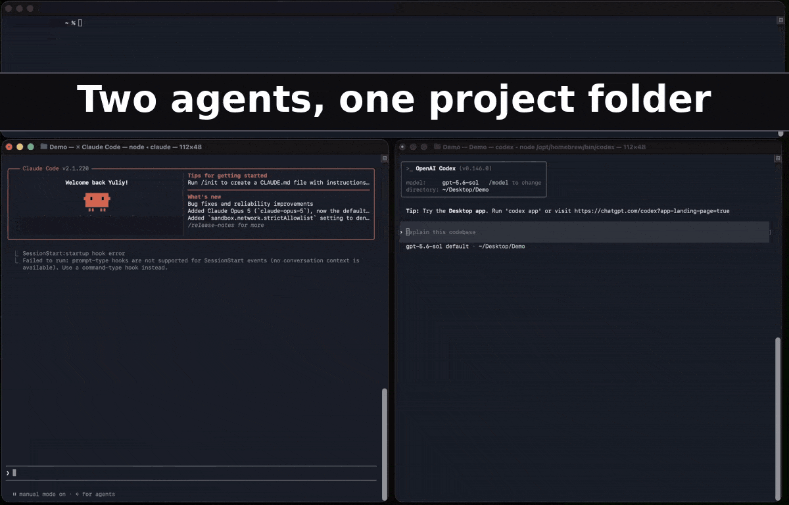

# Aplexica

**Use Claude Code and Codex together. Same memory, same skills, and resume either one's session in the other.**

Aplexica is a local daemon that keeps your AI coding agents in sync. It watches where each agent stores its memory, skills, MCP config, and conversation history, translates them into one canonical event log, and writes them back out in every other agent's native format. Deterministic translation, not an LLM summary: the next agent doesn't read *about* your last session, it continues it.

Works with Claude Code, Codex, Hermes, OpenClaw, and Kilo Code. Runs entirely on your machine. No account, no telemetry, no network required.

[](LICENSE)
[](CHANGELOG.md)



## Try it in 60 seconds

You need two supported agents installed. The example uses Codex and Claude Code.

```bash
brew install Aplexica/tap/aplexica
```

```bash
aplexica setup --yes --install
```

Then turn on sync. Aplexica imports from your agents right away but writes nothing to any of them until you say so:

1. Open the local web UI with `aplexica web open` (the tray icon opens it too).
2. Go to **Routing rules**, choose **Add from preset**, and pick **Sync everything everywhere**.
3. Enable the receivers:

```bash
aplexica sync enable --all
```

```bash
aplexica daemon reload
```

`--all` enables every installed agent at once. If one of them is running right
now, close it first, or name only the agents you want with
`aplexica sync enable codex claude-code` — an agent that keeps its history in a
database reads it at startup, so writing to it underneath a live process is
worth avoiding. Aplexica snapshots every agent's native files before its first
write either way, and `aplexica restore-native` puts them back.

Now ask Codex anything:

```text
What is the largest planet in our solar system?
```

Open a second terminal, run `claude`, type `/resume`, and pick the conversation named `Codex: what is the largest planet in our solar system?`. Claude Code continues the conversation from its own native history. Ask a follow-up there, and it appears in Codex. For Hermes, close and reopen it before the refreshed conversation list appears.

Other install channels (Debian/Ubuntu `.deb`, Windows `.zip`, verified archives, build from source) are under [Install](#install).

## What it does

- **One memory for every agent.** Write a memory in Claude Code, and Codex, Hermes, OpenClaw, and Kilo Code have it within seconds. Skills and MCP tool config sync the same way.
- **Resume any conversation in any agent.** Session history is translated into each agent's own session format, so `/resume` just works.
- **Fork a conversation across agents.** Branch a session into a second agent to try a different direction, keep both, compare.
- **Choose what syncs where.** Tags and TOML routing rules send work memories to work agents and keep private ones where they started.
- **Back up and restore.** Snapshot everything your agents know, restore after a lost laptop or a reinstall.

## What it is not

- **Not a Cursor, Gemini CLI, Copilot, or Windsurf integration yet.** Five agents are supported today. Each is an adapter package behind one interface; see [docs/adapters/](docs/adapters/). Open an issue for the one you want.
- **Not a hosted service.** The daemon is complete on its own. An optional, end-to-end encrypted relay for syncing between your own machines is at [aplexica.com](https://www.aplexica.com/).
- **Not a summarizer.** Nothing is paraphrased by a model. State is replicated exactly.

## Why this exists

Picking an AI coding agent is a one-way door. After a few weeks the memories, skills, MCP servers, and conversations you've built up are what make the agent useful, and they only exist in that agent's format. Switching means starting over. Running two side by side means maintaining two copies by hand. Trying the agent that shipped yesterday means abandoning everything.

Aplexica turns that state into something you own and that follows you to every agent you use.

**Uninstall test.** A portability tool should survive its own removal. See the [Uninstall Test](https://www.aplexica.com/#uninstall-test).

---

## Install

Aplexica installs three executables together:

- `aplexica` — CLI, daemon, local web UI server, and setup wizard.
- `aplexica-status` — status helper the tray spawns, so process monitors can
  tell the watcher apart from the daemon.
- `aplexicatray` — menu bar / system-tray companion.

The local web UI is compiled into `aplexica` itself in release builds; there is
no separate UI package to install.

### Quick install

**macOS / Linux — Homebrew:** Homebrew is a live channel at 1.0.74.
Full steps: [brew.md](docs/install/brew.md).

```bash
brew install Aplexica/tap/aplexica
```

```bash
aplexica setup --yes --install
```

**Debian / Ubuntu — `.deb`:** follow the exact-version download and
verification steps in [apt.md](docs/install/apt.md), then:

```bash
aplexica setup --yes --install
```

**Windows (release archive):** download `aplexica-1.0.74-windows-amd64.zip` or
`aplexica-1.0.74-windows-arm64.zip` from the
[v1.0.74 release](https://github.com/Aplexica/Aplexica/releases/tag/v1.0.74),
verify it following [verify.md](docs/install/verify.md), unzip it into a folder
you own, and run `aplexica.exe` or `aplexicatray.exe` from that folder. Full
steps, including start-at-logon: [windows.md](docs/install/windows.md). Then:

```bash
aplexica setup --yes --install
```

That one `setup` command registers and starts the daemon, installs and launches
the tray when it is enabled (the default on every supported desktop OS), and
brings up the local web UI. Adapters are built in and auto-discover your
agents.

| Platform | Channel | Status and guide |
|---|---|---|
| Debian / Ubuntu | Versioned `.deb` | Available; [apt.md](docs/install/apt.md) |
| Any | Direct install from a verified archive | Available; [direct.md](docs/install/direct.md) |
| Any | Build from source | Available; [build.md](docs/install/build.md) |
| macOS / Linux | Homebrew | Available at 1.0.74; [brew.md](docs/install/brew.md) |
| Windows 10/11 | Release .zip archive | Available; [windows.md](docs/install/windows.md) |
| Any | In-place direct update | Not provided — use the installing channel; [update.md](docs/install/update.md) |

Install shell completions for Bash, Zsh, Fish, and PowerShell with the
[shell completion guide](docs/install/completions.md).

### Release authentication

Aplexica release authority is a non-exportable AWS KMS key—not GitHub, a CDN, a package registry, or a maintainer workstation. Each release ships a KMS-backed cosign signature over `SHA256SUMS` and a KMS-backed, public-policy-checked SLSA v1 provenance bundle. GitHub Actions receives only a short-lived AWS session for the isolated signing job; the publication job has no signing authority.

Verify `SHA256SUMS` with the independently distributed `aplexica-release.pub`, check the selected artifact digest, and verify its provenance and semantic policy. GitHub Releases, a NAS, USB, or a local HTTP directory may all transport the same authenticated bytes. The exact commands are in [Verify a release](docs/install/verify.md). Never pipe downloaded text to a shell or PowerShell expression.

### Build from source

Development builds use the public Go source directly:

```bash
git clone https://github.com/Aplexica/Aplexica.git
cd Aplexica
make build
make tray
```

The local web UI is replaced by an explanatory placeholder unless
`internal/web/embed/dist-local/` contains a Portal bundle. Release-style builds
add `-tags release`, which makes the daemon fail closed when that bundle is
missing; development builds can omit the tag. See the
[source-build guide](docs/install/build.md) for tests, cross-compilation, and
local installation.

## Quickstart (under 10 minutes)

```bash
# 1. Install Aplexica using one of the available methods in docs/install/.

# 2. Register and start the daemon, install tray autostart, launch the tray, and
#    bring up the local web UI. The tray is enabled by default on every OS.
aplexica setup --yes --install
aplexica status
#    (Run `aplexica setup` with no flags for an interactive walkthrough.)

# 3. Watch the canonical store
aplexica list                                # nothing yet — agent state hasn't been imported

# 4. Add at least one matching routing rule first; docs/quickstart.md gives
#    the exact TOML and `aplexica rules add` command. Then enable receivers.
aplexica sync enable --all                   # or name specific agents
aplexica daemon reload

# 5. Let your agents create artifacts naturally. Once Claude Code,
#    Codex, or any other supported agent writes its native file, the
#    daemon imports it within ~2 seconds and fans it out to every
#    enabled agent's native location.

# 6. Anywhere along the way:
aplexica list                                # see every artifact across kinds
aplexica show <artifact-id>                  # inspect one
aplexica conflicts list                      # any divergent writes that need your decision
aplexica branch list <artifact-id>           # branch topology if you've forked
```

A guided walkthrough from install to working two-agent sync lives at [docs/quickstart.md](docs/quickstart.md).

## What's supported (V1)

Five V1 agents, four artifact kinds, full bidirectional translation:

| Agent | Surfaces | Vendor | Memory | Skill | Conversation | Tool | Canonical conv (`acf.conversation.v1`) |
|---|---|---|---|---|---|---|---|
| Claude Code | CLI + Desktop | Anthropic | ✅ markdown | ✅ skill.md | ✅ session.jsonl | ✅ MCP (.mcp.json) | ✅ |
| Codex | CLI + Desktop | OpenAI | ✅ AGENTS.md | ✅ skill.md | ✅ session.jsonl | ✅ MCP (config.toml) | ✅ |
| Hermes | CLI | Nous Research | ✅ MEMORY.md / USER.md | ✅ skill.md | ✅ SQLite (state.db) | ✅ MCP (config.yaml) | ✅ |
| OpenClaw | CLI | community | ✅ MEMORY/AGENTS/CLAUDE/DREAMS.md + memory/YYYY-MM-DD.md | ✅ skill.md | ✅ session JSONL | ✅ MCP (openclaw.json) | ✅ |
| Kilo Code | CLI | Kilo | ✅ AGENTS.md / AGENT.md | ✅ skill.md | ✅ SQLite (`kilo.db`) + `kilo import` | ✅ MCP (kilo.jsonc) | ✅ |

Adding a new agent is one adapter package behind a single interface. Much of an adapter is the translation of that agent's session format, so expect a substantial package rather than glue code. See [docs/adapters/](docs/adapters/) for per-agent specs and [internal/adapter/openclaw/](internal/adapter/openclaw/), the smallest complete adapter, as a reference implementation.

## Architecture in one paragraph

Each supported agent has an **adapter** that translates between its native format and the **Aplexica Canonical Format (ACF)** — an append-only event log per artifact, hash-chained for integrity, plus a typed payload. State lives in the user-owned **canonical store** at `~/.aplexica/store/`. The daemon, run through `aplexica daemon`, watches each agent's native location and runs the import → fan-out cycle on every change. Secrets live in a separate protected store and never enter the canonical event log. The whole stack is **deterministic and lossless** — no LLM summarization, no consolidation, no briefing layer.

The public BRDs in [docs/](docs/) describe the canonical format and local
product requirements.

## Selective sync, forking, branching

Power-user workflows are first-class:

- **Branches.** `aplexica fork <artifact> --from <event> --to-agent codex` creates a divergent branch; the source agent's view is unchanged. `aplexica log --graph <artifact>` renders the topology. `aplexica merge <artifact> --from <branch> --into <branch>` reconciles.
- **Selective sync.** `aplexica tag add <artifact> work` then a TOML rule like `route.agents = ["claude-code", "codex"]` routes that artifact only to your work agents. `aplexica rules test <artifact>` explains every routing decision.
- **Stays-local content.** Tags are metadata, not policy, and no routing rules
  are active by default. To keep a `private` memory on its originating agent,
  add an explicit rule matching that tag with
  `route.agents = ["__originatingAgent__"]` and `route.remote = "exclude"`;
  the [quickstart](docs/quickstart.md#8-selective-sync) gives the complete rule
  and safe replacement sequence.

Full reference: [docs/04-brd-forking-and-merging.md](docs/04-brd-forking-and-merging.md), [docs/05-brd-selective-sync-and-routing.md](docs/05-brd-selective-sync-and-routing.md).

## Tray indicator

`aplexicatray` is a cross-platform menubar / system-tray / SNI indicator that reflects daemon state at a glance:

| Icon | Meaning |
|---|---|
| Idle | Daemon up, no recent activity |
| Active | Snapshot ticks arriving |
| Paused | Daemon up but quiet for ≥ 5 minutes |
| Conflict | Unresolved conflicts (overrides other states) |
| Error | Daemon not reachable |

Right-click for `Pause / Resume`, `Show Conflicts`, `Open Logs`, `Pending Projects`, and `Open Aplexica`. Packaged installs include it, and `aplexica daemon install` wires it to start with Aplexica on every desktop OS unless you explicitly opt out.

## Documentation

| Path | Purpose |
|---|---|
| [docs/00-vision.md](docs/00-vision.md) | North-star vision and scope |
| [docs/user-guide.md](docs/user-guide.md) | Complete CLI, tray, and local web UI user guide |
| [docs/quickstart.md](docs/quickstart.md) | 10-minute install + sync walkthrough |
| [docs/install/](docs/install/) | Per-platform / per-channel installation |
| [docs/01-brd-backup-restore.md](docs/01-brd-backup-restore.md) | Local export, import, convert |
| [docs/02-brd-format-adapters.md](docs/02-brd-format-adapters.md) | Canonical format + per-agent adapters |
| [docs/03-brd-local-realtime-sync.md](docs/03-brd-local-realtime-sync.md) | Same-machine multi-agent sync daemon |
| [docs/04-brd-forking-and-merging.md](docs/04-brd-forking-and-merging.md) | Branch / fork / merge model |
| [docs/05-brd-selective-sync-and-routing.md](docs/05-brd-selective-sync-and-routing.md) | Tags, rules, per-agent routing |
| [docs/09-security-and-trust-model.md](docs/09-security-and-trust-model.md) | Threat model, file permissions, supply chain |
| [docs/10-non-functional-requirements.md](docs/10-non-functional-requirements.md) | Performance, reliability, platforms |
| [docs/adapters/](docs/adapters/) | Per-agent adapter specs |
| [docs/plugin-protocol-spec.md](docs/plugin-protocol-spec.md) | Public JSON-RPC plugin protocol |
| [docs/plugin-author-guide.md](docs/plugin-author-guide.md) | Building an out-of-process plugin |
| [CHANGELOG.md](CHANGELOG.md) | Per-release notes |

## Contributing

Aplexica welcomes contributions. Start with [CONTRIBUTING.md](CONTRIBUTING.md) for branch / commit / test conventions, then open a PR.

- Contributions are accepted under a **Contributor License Agreement**. The CLA grants Aplexica the right to distribute your contribution under AGPL-3.0 *and* under a separate commercial license. A bot comments on your first PR with the signing link; see [CONTRIBUTING.md](CONTRIBUTING.md) for the full terms.
- Bug reports → [issues](https://github.com/Aplexica/Aplexica/issues) with the `bug_report` template.
- Security vulnerabilities → **do not file a public issue**; see [SECURITY.md](SECURITY.md) for the responsible-disclosure address and policy.
- Community conduct → [CODE_OF_CONDUCT.md](CODE_OF_CONDUCT.md) (Contributor Covenant 2.1).

## License

Aplexica OSS is licensed under the **GNU Affero General Public License v3.0** ([LICENSE](LICENSE)).

The AGPL-3.0 plugin-boundary stance is documented in [LICENSE-EXCEPTIONS.md](LICENSE-EXCEPTIONS.md): third-party plugins running in their own process and communicating with the `aplexica` daemon via the documented JSON-RPC stdio protocol are **NOT considered derivative works of the daemon** for AGPL-3.0 purposes. See that document for the full legal statement.

## Project status

Aplexica is under active development. Use the [release
page](https://github.com/Aplexica/Aplexica/releases) and
[CHANGELOG.md](CHANGELOG.md) for shipped-version status.
